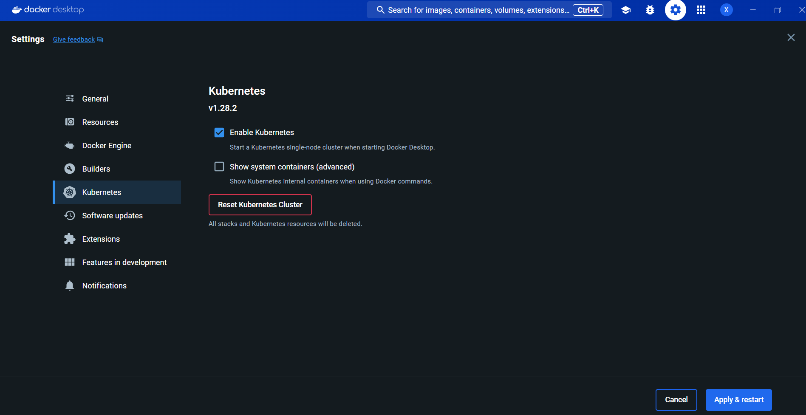
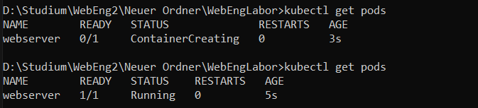
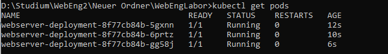
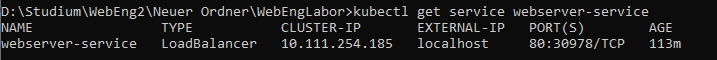

# WebEngLabor

# Docker
## Voraussetzungen

Es muss Docker Desktop installiert und am laufen sein

## Dockerfile
Das Dockerfile ist für die Erstellung des Docker Images Notwendig. In diesem wird zum einen Definiert welches Base Image für den Docker Container verwendet werden soll und welche Dateien auf das Image Copiert werden sollen. Außerdem können zusätzlich noch Commands aufgerufen und Port freigegeben werden. 

Unser Dockerfile sieht wie folgt aus:

```yaml
FROM nginx:latest
COPY ./index.html /usr/share/nginx/html/index.html
```

Gespeichert wird das in einer Datei Namens "Dockerfile"

Es wird als Base Image ein Image genommen welches bereits einen Webserver laufen lässt und diesen auf dem Port 80 bereitstellt, wesegen der Port 80 nicht mehr freigegeben werden muss. Anschließend werden die Benötigten Dateien in den html Ordner kopiert, da der Webserver in diesem Ordner nach den Dateien sucht.

## DockerImage

Nach dem das Dockerfile erstellt wurde, muss dieses zu einem Image gebaut werden. Dies geschieht mit dem folgenden Comand:

```
docker build -t deinbenutzername/webserver:latest .
```

webserver ist hierbei der Name des Images

## DockerImage Speichern und Laden(Kann übersprungen werden)
Das erstellte DockerImage kann mit dem Comand

```
docker save -o webserver-image.tar deinbenutzername/webserver
```
gespeichert werden und an andere weitergeben werden.

Geladen wird das Image mit

```
docker load -i webserver-image.tar
```

## DockerImage in Repo hochladen

Damit andere Anwendungen mit dem Image arbeiten können muss das Image in einem DockerRepo bereitgestellt werden. **Bitte nur Lokales Repo oder Alternativ Dockerhub ausführen**

### Lokales Repo

Wenn das Image nicht in ein online Repo hochgeladen werden soll kann mit dem Folgenden Coand ein Lokales Repo erstellt werden

```
docker run -d -p 5000:5000 --restart=always --name registry registry:2
```

Anschließend muss das Image auf das Repo gepushed werden 

```
docker tag deinbenutzername/webserver:latest localhost:5000/deinbenutzername/webserver:latest
```
und 
```
docker push localhost:5000/deinbenutzername/webserver:latest
```
Ob das image nun bereitgestellt wird kann mit
```
curl http://localhost:5000/v2/_catalog
```
überprüft werden.

### Alternativ Dockerhub
**Durch das hochladen auf DockerHub ist das Image für alle sichtbar, weswegen ein Lokales Repo im Firmenumfeld empfolen wird!!!**


Alternativ kann das Docker Image auch auf Dockerhub hochgeladen werden.

```
docker tag deinbenutzername/webserver:latest deinbenutzername/webserver:latest
```

```
docker login
```

```
docker push deinbenutzername/webserver:latest
```

## Docker Image Starten
Das Gebaute Docker Image kann nun mit

```
docker run -p 80:80 --name webser deinbenutzername/webserver:latest
```

gestartet werden.

# Kubernetes
Dieser Abschnitt setzt voraus, dass ein Docker Image in einem Repo verfügbar ist und gepulled werden kann. Wie ein Image in einem Repo verfugbar gemacht werden kann wird in dem Abschnitt Docker beschrieben

## Vorrausetzungen

### Kubernetes Single-Node Cluster Installieren
Um Kubernetes verwenden zu können muss ein K8s Kluster installiert werden. mit Docker Desktop ist dies in den Einstellungen möglich



nun muss Apply & Restart gedrückt werden. 

### Kubectl installieren
```
curl.exe -LO "https://dl.k8s.io/release/v1.28.4/bin/windows/amd64/kubectl.exe"
```
Im anschluss die Exe installiert werden.

Nun sollte im Trminal der Befehl "kubectl" zur Verfügung stehen 

## Erster Test

Um zu Überprüfen ob alles funktioniert hat, kann ein test Pod erstellt werden

Bei einem Lokalen Repo mit:
```
kubectl run webserver --image=localhost:5000/deinbenutzername/webserver:latest --port=80
```

Bei DockerHub mit:
```
kubectl run webserver --image=deinbenutzername/webserver:latest --port=80
```

Nun kann der Pod mit 
```
kubectl get pods
```
Angezeigt werden der Output sollte wie Folgt aussehen:


**Der Pod sollte nun wieder gelöscht werden da im Anschluss mit einer deployment.yaml gearbeitet wird, welche die Skalierung der Clusters vereinfacht**

```
kubectl delete pod webserver
```

## Deployment.yaml

### Lokales Repo
Eine Beispiel deployment.yaml sieht wie Folgt aus:

```
apiVersion: apps/v1
kind: Deployment
metadata:
  name: webserver-deployment
spec:
  replicas: 3
  selector:
    matchLabels:
      app: webserver
  template:
    metadata:
      labels:
        app: webserver
    spec:
      containers:
      - name: webserver-container
        image: localhost:5000/deinbenutzername/webserver:latest
        ports:
        - containerPort: 80
```

Mit dem Image Attribut wird angegeben mit welchem Docker Image das Cluster gebaut werden soll. Mit Replicas wird die Anzahl der pods bestimmt.

Nach dem die Deployment.yaml erstellt wurde, muss diese noch geladen werden werden.

```
kubectl apply -f webserver-deployment.yaml
```
nun sollten 3 Pods erstellt werden



### Dockerhub

Eine Beispiel deployment.yaml sieht wie Folgt aus:

```
apiVersion: apps/v1
kind: Deployment
metadata:
  name: webserver-deployment
spec:
  replicas: 3
  selector:
    matchLabels:
      app: webserver
  template:
    metadata:
      labels:
        app: webserver
    spec:
      containers:
      - name: webserver-container
        image: deinbenutzername/webserver:latest
        ports:
        - containerPort: 80
```

Mit dem Image Attribut wird angegeben mit welchem Docker Image das Cluster gebaut werden soll. Mit Replicas wird die Anzahl der pods bestimmt.

Nach dem die Deployment.yaml erstellt wurde, muss diese noch geladen werden werden.

```
kubectl apply -f webserver-deployment.yaml
```
nun sollten 3 Pods erstellt werden


## Service.yaml

In diesem Schritt wird das erstellte Cluster nach außen verfügbar gemacht. Dazu wird eine service.yaml benötigt, welche wie folgt aussieht:

```
apiVersion: v1
kind: Service
metadata:
  name: webserver-service
spec:
  selector:
    app: webserver
  ports:
    - protocol: TCP
      port: 80
      targetPort: 80
  type: LoadBalancer 
```

Die yaml muss nun noch auf das Cluster Angwendet werden.

```
kubectl apply -f webserver-service.yaml
```

Nun kann mit

```
kubectl get service webserver-service
```
überprüft werden ob eine externe IP zurverfügung steht.



Nun ist der Inhalt des Docker Containers unter der 127.0.0.1:80 erreichbar. 

## Skalieren des Clusters

Mit dem Befehl
```
kubectl scale deployment webserver-deployment --replicas=10
```

kann die Anzahl der Pods verändert werden.
